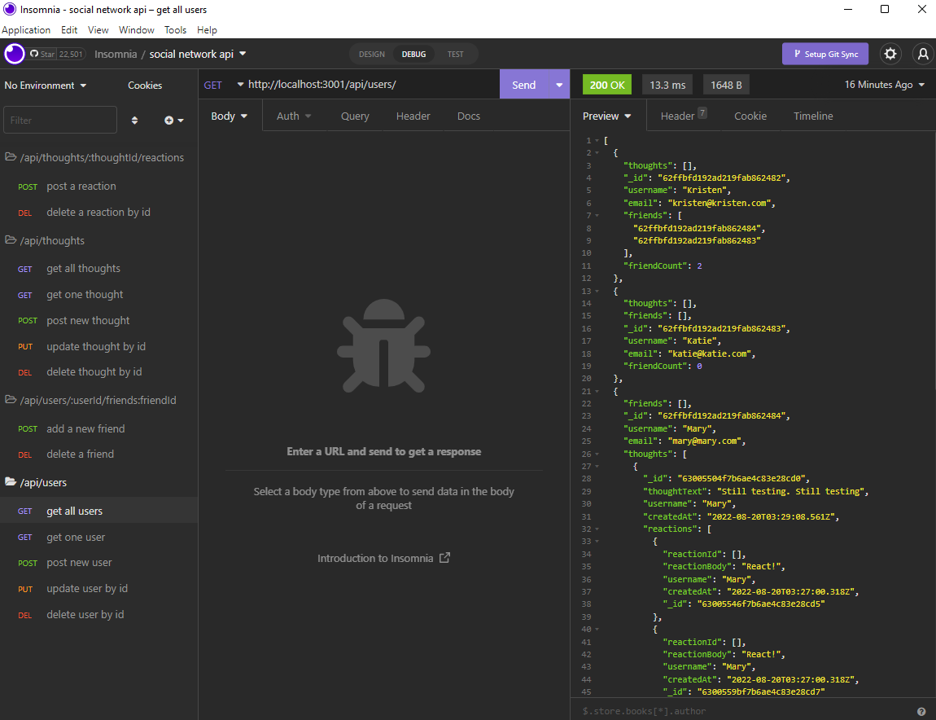

# Social Media API

## Overview
This project is to construct a new social media API utilizing the Mongoose package with Mongodb. The API features users, thoughts (posts), reactions to those thoughts, and a friends list.

## Description
This API stores all users, their friends in the social media app, their posted thoughts, and their friends' reactions to those thoughts. Users can post, put, and delete their thoughts, as well as adding or deleting friends from their friend list. Routes also include the opportunity to view all thoughts and users as well as targeting individual users and individual thoughts with component attributes and virtuals for more usable data.

## Table of Contents

1. [Installation](#installation)
2. [Usage](#usage)
3. [Licenses](#licenses)
4. [Contributing](#contributing)
5. [Tests](#tests)
6. [Questions](#questions)

## Installation
A link to the deployed site can be found [here](https://drive.google.com/file/d/1NltFqIrLZGvu03KGOmWRQdQQiKbwJh1S/view). A screenshot of the site is shown below: 

## Usage
To run this program, please install all dependencies in the package.json file. Additionally, the API can optionally be seeded using the script in the package.json or a user can start the server directly by using nodemon or node server.js.

## Licenses
This project uses the MIT license. More info about licenses can be found [here](https://choosealicense.com/).

## Contributing
This project is open for contribution but please initiate an issue for any significant changes. 

## Tests
There are no testing instructions for this application at this time.

## Questions
The developer can be reached through [email](kristen.l.santee@gmail.com) or contacted through [Github](https://github.com/kristensantee) or [LinkedIn](https://linkedin.com/in/kristen-santee).
